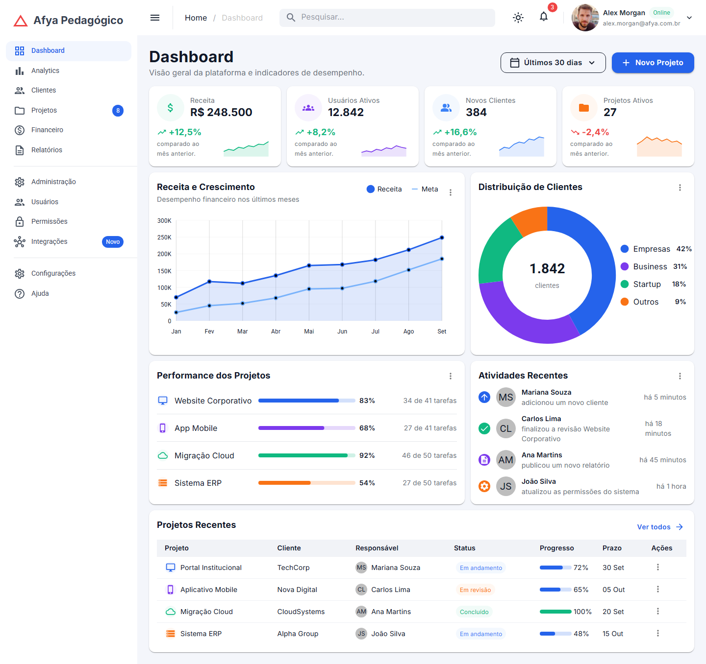
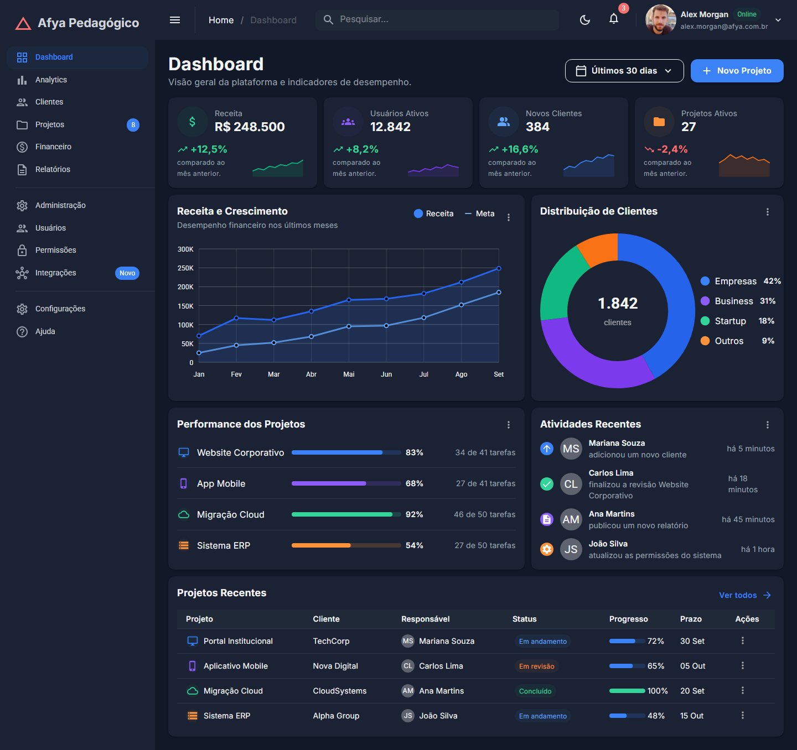
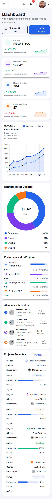

# Afya Admin — Dashboard com Blazor WebAssembly e MudBlazor

## Identificação

| | |
|---|---|
| **Aluno(a)** | Joaquim Camillo |
| **Matrícula** | _preencher_ |
| **Faculdade** | _preencher_ |
| **Curso** | _preencher_ |
| **Disciplina** | _preencher_ |
| **Professor(a)** | _preencher_ |
| **Semestre** | 2026.2 |

## Objetivo do projeto

_preencher_

## Tecnologias utilizadas

- .NET 10 / Blazor WebAssembly autônomo (standalone)
- MudBlazor 9: componentes, tema, gráficos e classes utilitárias
- C# e Razor
- Fonte Inter (Google Fonts)
- Git e GitHub

## Como executar

É necessário o **.NET SDK 10** (`dotnet --version` deve começar com `10.`).

```bash
git clone https://github.com/Joaquim-Netoo/afya-admin.git
cd afya-admin
dotnet watch
```

O `dotnet watch` compila, abre o navegador e recarrega a página a cada alteração salva.
A URL aparece no terminal; a porta fica em `Properties/launchSettings.json`.

## Telas

### Tema claro


### Tema escuro


### Versão mobile


### HTML gerado (DevTools)


_preencher: o que o print mostra_

## Estrutura do projeto

```
afya-admin/
├── Components/
│   ├── AtividadesRecentes.razor
│   ├── CabecalhoPagina.razor
│   ├── DashboardCard.razor
│   ├── GraficoDistribuicaoClientes.razor
│   ├── GraficoReceita.razor
│   ├── KpiCard.razor
│   ├── PerformanceProjetos.razor
│   ├── ProjetosRecentes.razor
│   ├── SeletorPeriodo.razor
│   └── Ui.cs
├── Data/
│   └── DashboardData.cs
├── Layout/
│   ├── MainLayout.razor
│   └── NavMenu.razor
├── Pages/
│   ├── Dashboard.razor
│   └── NotFound.razor
├── Properties/launchSettings.json
├── docs/prints/
├── wwwroot/
│   ├── css/app.css
│   ├── img/alex-morgan.jpg
│   └── index.html
├── _Imports.razor
├── afya-admin.csproj
├── App.razor
└── Program.cs
```

| Pasta | Papel |
|---|---|
| `Components` | blocos visuais reutilizáveis, que recebem os dados por parâmetros |
| `Data` | modelos (`record`) e dados fictícios do dashboard |
| `Layout` | moldura comum a todas as páginas: tema, AppBar, sidebar e menu |
| `Pages` | componentes com rota (`@page`); o `Dashboard.razor` só monta os componentes |
| `wwwroot` | arquivos estáticos servidos ao navegador: `index.html`, CSS do template e imagens |

## Componentes criados

| Componente | Responsabilidade | Parâmetros que recebe |
|---|---|---|
| `DashboardCard` | card base com título, subtítulo opcional, área de ações, menu "⋮" opcional e conteúdo | `Titulo` (obrigatório), `Subtitulo`, `Acoes`, `Menu`, `ChildContent` |
| `CabecalhoPagina` | título e subtítulo da página, com os botões de ação à direita | `Titulo` (obrigatório), `Subtitulo`, `Acoes` |
| `SeletorPeriodo` | menu com cara de botão para escolher o período; funciona com `@bind-Valor` | `Opcoes` (obrigatório), `Valor`, `ValorChanged` |
| `KpiCard` | indicador com ícone, valor, variação e sparkline | `Kpi` (obrigatório) |
| `GraficoReceita` | gráfico de linha Receita x Meta com legenda própria | `Meses`, `Receita`, `Meta` (obrigatórios) |
| `GraficoDistribuicaoClientes` | gráfico de rosca com o total no centro e legenda com percentuais | `Total`, `Segmentos` (obrigatórios) |
| `PerformanceProjetos` | lista de projetos com barra de progresso, percentual e tarefas | `Projetos` (obrigatório) |
| `AtividadesRecentes` | feed com ícone da ação, avatar com iniciais, descrição e tempo | `Atividades` (obrigatório) |
| `ProjetosRecentes` | tabela responsiva com status, progresso, prazo e menu de ações | `Projetos` (obrigatório) |

`Ui.cs` não é um componente: é uma classe estática com `FundoSuave` (classe de fundo suave da cor) e `Iniciais` (iniciais de um nome).

## O que aprendi

1. **Como uma aplicação Blazor WebAssembly inicia no navegador?**

   _preencher_

2. **Qual é a diferença entre um Layout, uma Page e um Component neste projeto?**

   _preencher_

3. **O que é um `RenderFragment` e como o `DashboardCard` usa esse recurso?**

   _preencher_

4. **Como funciona o `@bind-Valor` no `SeletorPeriodo`? Qual é o papel do `ValorChanged`?**

   _preencher_

5. **Por que os dados ficam na pasta `Data`, separados dos componentes?**

   _preencher_

6. **Como o `MudGrid` com `xs`, `sm` e `lg` reorganiza os cards de KPI?**

   _preencher_

7. **Como foi possível estilizar a página inteira sem escrever CSS?**

   _preencher_

8. **Por que o namespace do projeto é `afya_admin` e não `afya-admin`?**

   _preencher_

## Dificuldades e soluções

_preencher_

## Melhorias futuras

**Desafio 7 da seção 20 implementado — lembrar o tema.** O `MainLayout.razor` injeta o `IJSRuntime` e, na primeira renderização (`OnAfterRenderAsync`), lê a chave `tema` do `localStorage`. Se existir, aplica o tema salvo; se não existir, usa o tema do sistema operacional com `GetSystemDarkModeAsync()` do `MudThemeProvider`. Ao clicar no botão de tema, a escolha é gravada no `localStorage`, sem arquivo JavaScript próprio.

Próximos passos possíveis:

- criar as páginas do menu (Clientes, Projetos...) e fazer o breadcrumb acompanhar a rota;
- fazer o período selecionado alterar os valores dos KPIs;
- carregar os dados de um JSON com `HttpClient` e, depois, de um serviço `IDashboardService`;
- fazer a busca da AppBar filtrar a tabela de Projetos Recentes.
